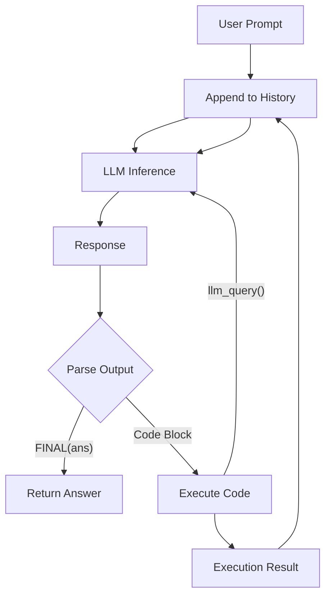

# Core Logic: Recursive Language Models (RLM)

## Overview

The Recursive Language Model (RLM) is a paradigm that transforms a standard Large Language Model (LLM) into an agent capable of recursive self-decomposition and code execution. Instead of a single inference pass, the RLM operates in a Read-Eval-Print Loop (REPL).

## The RLM Loop

The core algorithm consists of the following steps, executed until a final answer is found or a maximum iteration count is reached:

1.  **Prompt Construction**:
    - The current conversation history, including previous user prompts, assistant responses, and code execution results, is assembled.
    - A system prompt is prepended, instructing the model on how to use the REPL environment (using ` ```repl ` blocks) and how to return a final answer (using `FINAL(...)`).

2.  **LLM Inference**:
    - The assembled prompt is sent to the LLM.
    - The LLM generates a text response.

3.  **Parsing**:
    - The response is parsed to identify:
        - **Code Blocks**: Segments enclosed in ` ```repl ... ``` `.
        - **Final Answer**: A pattern indicating completion, e.g., `FINAL(answer)` or `FINAL_VAR(var_name)`.

4.  **Execution (if code blocks found)**:
    - If code blocks are present, they are extracted and executed in a persistent environment.
    - The environment captures `stdout`, `stderr`, and changes to local variables.
    - **Recursion**: The executed code has access to a function (e.g., `llm_query`) that allows it to invoke the LLM again. This enables the model to spawn sub-tasks programmatically.

5.  **History Update**:
    - The LLM's response and the subsequent execution results (or errors) are appended to the conversation history.
    - This updated history serves as the context for the next iteration.

6.  **Termination**:
    - If a Final Answer is detected, the loop terminates, and the answer is returned.
    - If the maximum number of iterations is reached, a default or fallback answer is generated.

## Recursion Mechanism

The defining feature of RLM is recursion. This is achieved by injecting a special function into the execution environment's global scope.

- **Function Signature**: `llm_query(prompt: str) -> str`
- **Behavior**:
    - When called by the generated code, this function halts code execution temporarily.
    - It sends the provided `prompt` to the LLM (either the same model or a different one).
    - It returns the LLM's response string back to the code.
- **Use Case**: This allows the model to break down complex problems. For example, to write a poem about a specific fact, it might first run `fact = llm_query("What is the height of Mt Everest?")` and then use `fact` in its subsequent logic.

## Data Flow Diagram


